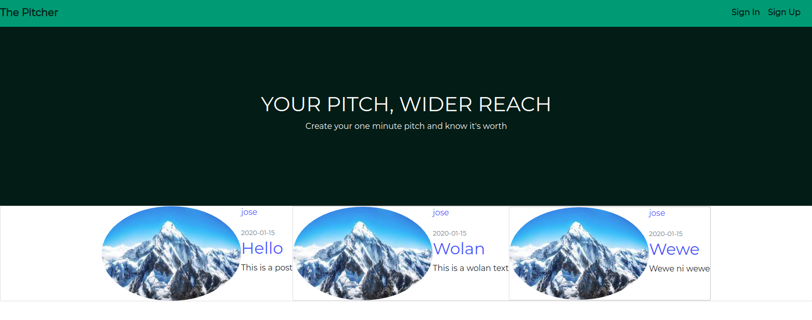

# The Pitcher

## Author
---
Anthony Ng'ang'a

## Description
___
This is a Flask web app that allows users to create an account and post one-minute pitches. Other users can then view the pitches, comment on them and upvote or downvote them.
___

## Live Link
___
You can find the live link [here](https://pitche.herokuapp.com/)

## BDD
___


1. Sign Up user on entering correct credentials
  - INPUT: "username"
  - OUTPUT: ""
  - INPUT: "email"
  - OUTPUT: ""
  - INPUT: "password"
  - OUTPUT: ""
  - INPUT: "confirm password"
  - INPUT: ""
2. Error on entering wrong data at Sign Up
  - INPUT: "existing username"
  - OUTPUT: "error notification that there's an existing username"
  - INPUT:  "existing email"
  - OUTPUT: "error notification that there's an existing email"
  - INPUT: "password does not match"
  - OUTPUT: "error notification that password does not match"
3. Adding a Pitch
  - INPUT: "pitch title"
  - OUTPUT: "pitch title"
  - INPUT: "pitch content"
  - OUTPUT: "pitch content"

## Setup Instructions
___
Open the terminal. Move to the directory you want to store the app e.g `cd Desktop`. Then type the following command `git clone https://github.com/Mantongash/pitcher.git`. Once it's done, navigate to the root directory of the app, `cd pitcher`. Then open it with your favorite code editor. Activate the virtual environment `. virtual/bin/activate`. Then install all of the dependencies using `pip install`

## Teachnologies Used
___
```asgiref==3.2.3
astroid==2.3.3
autopep8==1.4.4
bcrypt==3.1.7
blinker==1.4
cffi==1.13.2
clear==1.0.1
Click==7.0
Django==3.0.2
Flask==1.1.1
Flask-Bcrypt==0.7.1
Flask-Login==0.4.1
Flask-Mail==0.9.1
Flask-SQLAlchemy==2.4.1
Flask-WTF==0.14.2
goodlogging==1.0.1
gunicorn==20.0.4
image==1.5.27
isort==4.3.21
itsdangerous==1.1.0
Jinja2==2.10.3
lazy-object-proxy==1.4.3
MarkupSafe==1.1.1
mccabe==0.6.1
Pillow==7.0.0
pycodestyle==2.5.0
pycparser==2.19
pylint==2.4.4
pytz==2019.3
rarfile==2.7
requests==2.6.0
six==1.13.0
SQLAlchemy==1.3.12
sqlparse==0.3.0
typed-ast==1.4.0
Werkzeug==0.16.0
wrapt==1.11.2
WTForms==2.2.1
```
## Future Plans
- Add upvote and downvote feature
- Implement a comment feature

### License
MIT Copyright (c) 2019 Anthony Ng'ang'a

Permission is hereby granted, free of charge, to any person obtaining a copy of this software and associated documentation files (the "Software"), to deal in the Software without restriction, including without limitation the rights to use, copy, modify, merge, publish, distribute, sublicense, and/or sell copies of the Software, and to permit persons to whom the Software is furnished to do so, subject to the following conditions:

The above copyright notice and this permission notice shall be included in all copies or substantial portions of the Software.

THE SOFTWARE IS PROVIDED "AS IS", WITHOUT WARRANTY OF ANY KIND, EXPRESS OR IMPLIED, INCLUDING BUT NOT LIMITED TO THE WARRANTIES OF MERCHANTABILITY, FITNESS FOR A PARTICULAR PURPOSE AND NONINFRINGEMENT. IN NO EVENT SHALL THE AUTHORS OR COPYRIGHT HOLDERS BE LIABLE FOR ANY CLAIM, DAMAGES OR OTHER LIABILITY, WHETHER IN AN ACTION OF CONTRACT, TORT OR OTHERWISE, ARISING FROM, OUT OF OR IN CONNECTION WITH THE SOFTWARE OR THE USE OR OTHER DEALINGS IN THE SOFTWARE.